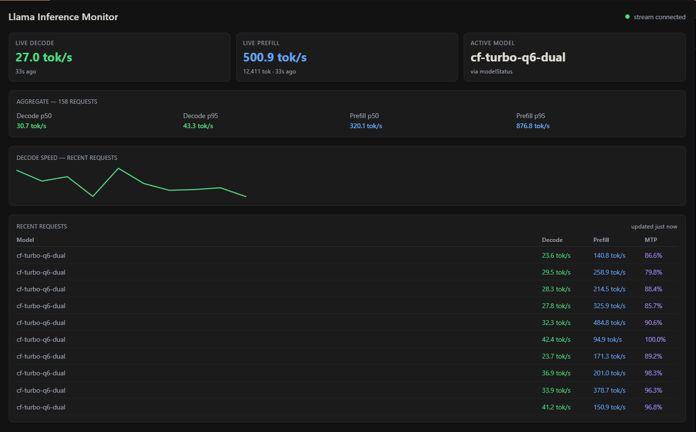

# Llama Inference Monitor

A [Hermes Desktop](https://hermes-agent.nousresearch.com) plugin that puts a live telemetry dashboard for [llama-swap](https://github.com/MostlyWhat/llama-swap) in your sidebar. No more `curl /api/metrics/stats` in a terminal like some kind of medieval peasant.

## What you get

- **Live Decode** — tokens/sec during generation, streamed over llama-swap's SSE endpoint (`tg_3s`), not polled
- **Live Prefill** — prompt-processing speed with a live in-progress token count (`26,985 tok · just now`)
- **Active Model** — whichever model llama-swap currently has `ready`, via the `modelStatus` stream
- **Aggregates** — p50/p95 decode and prefill across your request history
- **Decode sparkline** — recent request speeds at a glance
- **Recent Requests table** — per-request model, decode, prefill, and **MTP speculative-decoding acceptance rate** (draft accepted / draft proposed)

Everything auto-refreshes: SSE for live metrics, 2s activity polling, 10s stats polling. If the stream drops, the header dot goes red and polling keeps the dashboard useful.

## Requirements

- Hermes Desktop app
- [llama-swap](https://github.com/MostlyWhat/llama-swap) running locally with metrics/activity enabled
- Tested against llama-swap v255 / Hermes Desktop 0.180.x

## Install

1. Copy the `llama-inference-monitor` folder into your Hermes desktop plugins directory:
   - Windows: `%USERPROFILE%\.hermes\desktop-plugins\`
   - Linux/macOS: `~/.hermes/desktop-plugins/`
2. In Hermes Desktop: `Ctrl+Shift+P` → **Reload desktop plugins**
3. Click **Inference Monitor** in the sidebar

## Configuration

By default the plugin talks to `http://127.0.0.1:8091`. If your llama-swap runs elsewhere or on another port, edit the `BASE` constant at the top of `plugin.js`.

## How it works

Three data sources, zero dependencies beyond the Hermes plugin SDK:

| Source | Used for |
|---|---|
| `GET /api/events` (SSE) | Live decode/prefill + active model. Envelopes arrive on the default `message` channel as `{type, data}` where `data` is a JSON string requiring a second parse. `logData` frames are batched multi-line upstream logs — the parser keeps the *last* match per frame. |
| `GET /api/metrics/activity` | Recent requests table + sparkline (rows live under `.data`) |
| `GET /api/metrics/stats` | Aggregate p50/p95 histograms |

## Credits

Built on Nevermore by **Nevermore Team — I, C, G** 🐦‍⬛ (India, Claude, Greg) — one cloud instance, one local instance, one very patient Captain.

MIT licensed. Fork freely, PRs welcome.
